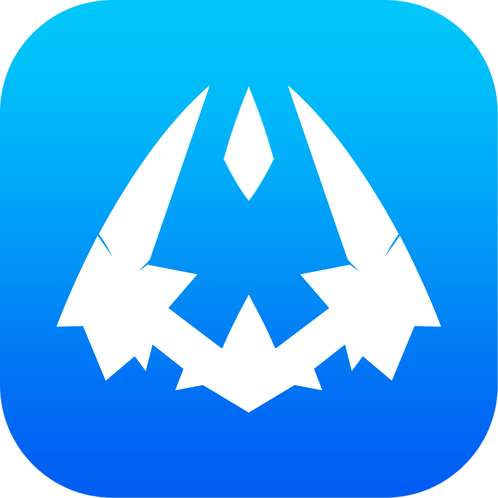

¡Aquí tienes el `README.md` perfecto para tu repositorio de GitHub! Está formateado con Markdown, listo para copiar y pegar. Incluye la información clave, la estructura del proyecto, cómo configurarlo, y una sección de uso, todo alineado con los últimos cambios y el diseño que hemos trabajado.

---

```markdown
# Discord Embed Creator - Bautic Studios



Este es un proyecto Flask para crear y enviar Discord Embeds de manera sencilla a través de un webhook. La interfaz de usuario ha sido diseñada para ser moderna y visualmente atractiva, inspirándose en los estilos de "OnlyPipe" y "Paysend link", con un fondo degradado vibrante y elementos limpios con efecto de glassmorphism sutil.

## 🌟 Características

* **Interfaz de Usuario Moderna:** Diseño limpio con un fondo degradado azul a negro, efecto de glassmorphism en los elementos, y sin sombras para un estilo plano y elegante.
* **Creación de Embeds Detallada:** Permite configurar todos los aspectos de un embed de Discord, incluyendo:
    * URL del Webhook
    * Autor (nombre, URL, ícono)
    * Cuerpo (título, descripción, URL)
    * Color del embed
    * Campos (Fields) dinámicos (nombre, valor, inline)
    * Imágenes (imagen principal, thumbnail)
    * Pie de página (texto, ícono)
    * Timestamp
* **Campos Dinámicos:** Agrega y elimina campos (`fields`) al embed en tiempo real directamente desde la interfaz, brindando flexibilidad para personalizar tus mensajes.
* **Validación de URL:** Ayuda a asegurar que las URLs introducidas para imágenes, enlaces y webhooks sean válidas.
* **Mensajes de Estado:** Proporciona retroalimentación clara en la interfaz sobre el éxito o fracaso del envío del embed.
* **Iconos de Bootstrap:** Integración de iconos modernos de Bootstrap para una mejor usabilidad y estética.
* **Favicon Personalizado:** Utiliza el logo de Bautic Studios como icono de la pestaña del navegador.

## 📂 Estructura del Proyecto

```
tu_proyecto/
├── app.py                     # Archivo principal de la aplicación Flask
├── templates/
│   └── index.html             # Plantilla HTML para la interfaz del creador de embeds
└── static/
    ├── css/
    │   └── style.css          # Estilos CSS personalizados para el diseño de la interfaz
    ├── js/
    │   └── script.js          # Lógica JavaScript para la interacción y construcción del embed
    └── images/
        └── logo.png           # Imagen del logo/favicon de Bautic Studios
```

## 🚀 Configuración y Ejecución

Sigue estos pasos para configurar y ejecutar el proyecto en tu entorno local.

### 1. Requisitos Previos

Asegúrate de tener [Python](https://www.python.org/downloads/) (versión 3.6 o superior recomendada) y `pip` (el gestor de paquetes de Python) instalados en tu sistema.

### 2. Preparación del Entorno

1.  **Crea tu estructura de carpetas** como se muestra en la sección "Estructura del Proyecto".
2.  **Coloca tus archivos** (`app.py`, `index.html`, `style.css`, `script.js`, `logo.png`) en sus respectivas ubicaciones.

### 3. Instalación de Dependencias

Navega hasta la carpeta raíz de tu proyecto (`tu_proyecto/`) en tu terminal y ejecuta el siguiente comando para instalar las librerías de Python necesarias:

```bash
pip install Flask requests
```

### 4. Ejecución de la Aplicación

Desde la misma carpeta raíz de tu proyecto (`tu_proyecto/`), ejecuta la aplicación Flask:

```bash
python app.py
```

### 5. Acceso al Dashboard

Una vez que la aplicación esté en funcionamiento, abre tu navegador web y navega a la siguiente dirección:

```
[http://127.0.0.1:5000/](http://127.0.0.1:5000/)
```

Deberías ver la interfaz del Discord Embed Creator con el diseño de Bautic Studios.

## 📋 Uso

1.  **Obtén tu Webhook URL:** En Discord, ve a la configuración de tu canal, luego a "Integraciones" y crea un nuevo Webhook. Copia la URL proporcionada.
2.  **Ingresa la URL del Webhook** en el campo "Discord Webhook URL" en la interfaz.
3.  **Rellena los detalles del embed** que desees enviar utilizando los diferentes campos (título, descripción, autor, color, etc.).
4.  Utiliza el botón **"Add Field"** en la sección "Fields" para añadir campos personalizados a tu embed. Puedes añadir múltiples campos.
5.  Una vez que tu embed esté listo, haz clic en el botón **"Send Embed"** (ubicado en la barra de navegación superior) para enviar el mensaje a tu canal de Discord.
6.  La interfaz mostrará un **mensaje de estado** (éxito o error) para indicarte el resultado del envío.

---

¡Listo para brillar en GitHub!
